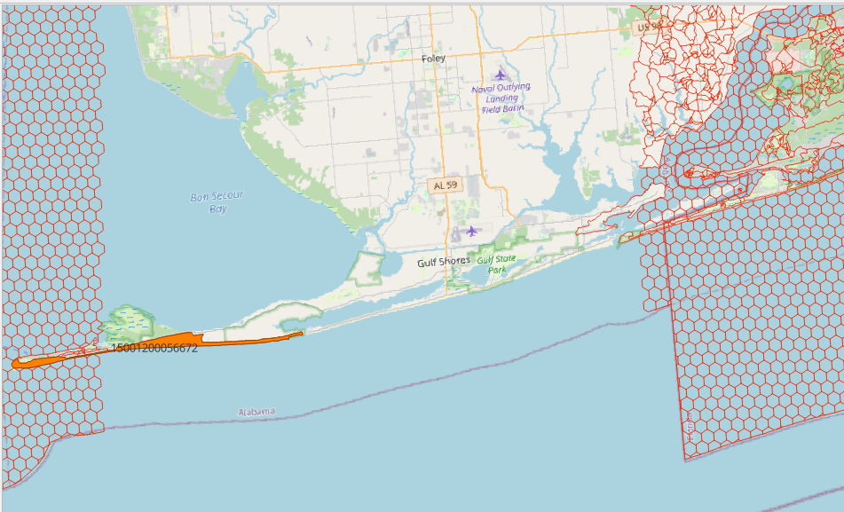

Geographic Information Systems utilize a variety of storage models for persisting spatial information.  Most folks in 2025 only use the long-established [vector-geometry-in-a-record](https://support.esri.com/en-us/gis-dictionary/spaghetti-data) format as stored in Esri shapefiles, OGC geopackages, GeoJSON, etc.  Within these formats, each concise spatial item has an independent existence.  One can alter, delete, or add new items without any affect upon others in the set.  Whether the items in that set or amongst multiple sets makes any spatial sense when considered together is entirely up to the user, the format provides no opinion.  Alternatively, there have always been other formats which decompose spatial features into smaller elements which can be shared amongst many features.  The traditional term for these formats has been the term, topology.  For a good modern example, see [TopoJSON](https://github.com/topojson/topojson).  There are many flavors of topology but for this discussion the subject is winged-edge [SQL-MM 3 Topologies](https://www.iso.org/standard/60343.html).  Implementations in 2025 would include [PostGIS Topology](https://postgis.net/docs/Topology.html) and the now-desolate [Oracle Spatial Topology](https://docs.oracle.com/en/database/oracle/oracle-database/23/topol/topology-data-model-overview.html).  My focus here is on PostGIS though topologies as a concept come into play.

Please note the [desktop Topology functionality](https://pro.arcgis.com/en/pro-app/latest/help/data/topologies/topology-in-arcgis.htm) provided by Esri desktop products is a related but very different animal.  Esri indeed has a long and storied history with topology formats, but that is mostly history.  If you are looking for help with what ArcGIS Pro calls a topology, this is not the place.

### Topics

* [Use Case](#use-case)
* [Problem Statement](#problem-statement)
* [Vocabulary](#vocabulary)
* [Resources](#resources)
* [PostgreSQL](#postgresql)
* [Preparation](#preparation)
* [Monitoring](#monitoring)
* [Multi-Processing](#multi-processing)
* [Maintenance](#maintenance)
* [Corruption](#corruption)
* [Mitigation](#mitigation)
* [Future Directions](#future-directions)
* [Useful Links](#useful-links)
* [Disclaimer](#disclaimer)

#### Use Case

Topology formats provide [many advantages](https://www.esri.com/news/arcuser/0401/topo.html) over vector-geometry-in-a-record systems.  Often folks will cite the ability to keep multiple layers of hierarchical entities in harmony or lower storage costs - all true.  However, my focus has been mostly on the fast aggregation of numerous and complex polygons.  Put simply, topologies move the cost of determining adjacency up-front.  If one can reify how an entire layer of polygons interact beforehand, one can quickly marshal arbitrary aggregations of those polygons on-demand.  Mathematically unioning together thousands (or even millions) of polygons is a task even the most current CPUs will choke on.  If we already have them in a topology then just determine the universe of faces comprising the aggregation and pull out the edges with one of those faces on one side but not the other.  Then chain the edges into rings to make the (multi)polygon result.  It still can take a while but the gory intersection math is only done once when the topology is created.

For over a decade I've been using topologies to model the [NHDPlus medium resolution](https://www.epa.gov/waterdata/nhdplus-national-hydrography-dataset-plus) catchment dataset.  Users commonly would like the watershed as a polygon for some arbitrary distance or flow time along a given stream network.  If this navigation crosses six catchments, sure we can mathematically union them together and return the results in short order.  But what about six thousand?  That is where topologies shine as we can get that ginormous six thousand catchment polygon for cheap.  And its the same relative cost if the user wants 5,999 or 6,001 catchments.  

NHDPlus is built from several elevation grids using several SRIDs.  The continental US (SRID 5070) is by far the largest and the only one of concern here.  My NHDPlus medium resolution topology of this area ingests 2.8 million catchments creating 7.5 million nodes, 10.8 million edges and 3.2 million faces.  It can take a solid week to throw together depending on resources, approach and time to babysit. However, the more recent [NHDPlus HR](https://www.usgs.gov/national-hydrography/nhdplus-high-resolution) is **a bit** larger delivering 23.3 million catchments.  How long will that take to crunch into a topology?  Are there tricks to speed up the process?  PostGIS bugs to submit?  Or am I going nowhere?  This tract is meant to chronicle the journey in the hopes others might glean some wisdom.

#### Problem Statement

Building a topology from a few thousand polygons is entirely reasonable as done following normal [PostGIS documentation](https://postgis.net/workshops/postgis-intro/topology.html).  If you are a person who is able to quickly marshall your datasets into a topology, then I probaly have nothing for you.  Just keep doing what you are doing.  Maybe get a bigger machine to make it faster.  

But SQL-MM topologies capture how every element relates to its planar neighbors.  As a topology grows, the computing resources to continually add new nodes, edges and faces grows.  At some point, its a problem.  My original NHDPlus MR catchment topology created in Oracle Spatial in 2011 took two months to crank out (mostly running nights and weekends).  Most folks would call that a problem though honestly it was done once and still drives US EPA services 15 years later.  Its up to you to say when its problem but never spurn the option to just it let it run.  Not everything needs optimization. 

#### Vocabulary

**face zero** - Face zero is the conceptual face that defines everything outside your topology (SQL-MM and Oracle Spatial term it the "universal face").  In PostGIS topology an edge with face zero on one side is by definition the exterior of your topology.  Face zero is distinct in that its much cheaper to work against and at this time multiple transactions can execute against face zero.  Keeping your activity focused upon face zero to leverage performance and multiprocessing is a huge part of this document. 

**big honkin' face (BHF)** - a BFH is large complex (usually) intermittent face created in the course of building a topology.  Unlike face zero, a BFH must be reified into a polygon for each transaction.  For example, adding a thousand faces along the perimeter of a BHF means walking the BHF's rings and creating a polygon from it's ever changing definition a thousand times.  This is slow.  But more importantly, individual elements (of which the BHF is one) cannot be simultaneously edited.  Any attempt to do so will corrupt your topology.  Avoiding BHFs is a theme of these notes. 

**cutter** - a single PostGIS process for adding one or more elements to a topology in a single transaction.  One might imagine them as cookie or pizza cutters clipping face zero into topology elements and entities (whatever metaphor works for you but that is mine).  Please note PostGIS Topology does not officially support multiple concurrent cutter processes at this time.  But we need to use them anyways.  This document is meant to show how to use many cutters simultaneously to greatly speed up topology creation.  But also be clear this is not supported by the PostGIS project.    

#### Resources

It would be interesting to know what other folks have available for tasks like this.  In my case I am using a little home server with 128 GB of RAM, 16 AMD cores and 2 mid-range NVME drives.  The database runs on the stock Debian PostgreSQL 16.8 [PostGIS docker image](https://hub.docker.com/r/postgis/postgis/) 3.5.2 on an Ubuntu host.  More cores and faster drives is always better but I don't myself know of absolute thresholds.  I do think trying this kind of thing on a 16GB Windows laptop is not going to work.

#### PostgreSQL

If you have access to your PostgreSQL configuration then tweaking things towards a small number of connections gorging on all available system resources is helpful.  Well, unless you share the database with others!  As I am the sole tenant, I set shared buffers to 1/3 of memory, effective cache to 3/4 of memory, stretch out the WAL to 64GB, set up huge pages using tuned for PostgreSQL.  But your ability to change this may be restricted with cloud or shared resources.  I feel being able to shove critical resources into the cache is vital but there is little benchmarking in this document. 

If you believe this will result in occasional OOM killing by the host OS, you are correct.  See [note 18.4.4](https://www.postgresql.org/docs/current/kernel-resources.html#LINUX-MEMORY-OVERCOMMIT) for details on skirting this issue AND be aware that certain kills can corrupt your topology.  Setting overcommit to "2" mitigates the issue _mostly_ for Ubuntu 24.  At least kills in mode 2 never seem to corrupt my topologies.  Dancing on the edge is dangerous.

#### Preparation

Going into topology creation with both a valid and clean layer is important.  Invalid polygons are just a show stopper, you gotta fix it first.  Messy (but valid) polygons are a slightly different issue.  When the source data is large, ideally you want to start with a clean vector coverage to craft the most compact topology possible for the least amount of effort.  If your goal is to load a bad coverage to do that cleanup using topology logic, well its a cool idea but one that is out of this document's scope. Every face comes with a cost and if your input is a mess you will have many faces per entity, greatly expanding out the creation cost.  I can't afford that cost when crafting my large topologies so thus I clean things up beforehand.  The new [PostGIS 3.6 coverage tools](https://postgis.net/docs/reference.html#Coverage) should be helpful and just tidying up the layer in a desktop GIS is always a solid approach.  Its a tad ironic but the aforementioned Esri topology functionality can be quite helpful in determining how clean or dirty your input layer is.

#### Monitoring

For many years I crafted large topologies in the dark.  I'd track progress by US state codes with only a vague idea where each cutter was acting.  This is dangerous for many of the reasons highlighted in this document.  Its very helpful to keep a close eye on the process.  QGIS is an excellent desktop tool for this.  Just add your edge table to a map project and watch things build.  This can help you spot BHFs or the risk of creating BHFs.  One can harvest bounding boxes directly from QGIS to drive your cutting.  

#### Multi-Processing

Launching multiple cutters is a key component but exactly how one controls those processes is beyond this document.  Automation is always a goal but at the same time the danger of corruption often argues for closer management and scrutiny of each cutter.  I am a bit ashamed to admit I often just pop off cutting actions as individual pgAdmin or nohup psql commands.  Crafting a control system would be swell but at the same time each topology is unique and for my purposes a one-time event.  Your critiques of my mismanagement of the workflow and suggestions for automation are always appreciated.

Most often topologies are created by just randomly throwing geometry into the maw.  With one cutting process it may not matter much.  There is almost certainly is a more performant order to feed the maw but determining that order may well cost more time and effort than chucking things in randomly.  But that is not an option if you plan to use multiple cutters.  Multiple cutters **must** stay away from each other and **must never** try to alter the same face - with the exception of face zero.   If you accidentally create a BHF, then only one cutter may ever approach and work on that region.  Avoid at all costs.  You need a plan of some kind.  Break your work into discrete untouching regions either by some kind of attribute (say a state or province code) or spatially.  The latter approach can be fraught as your source data is not guaranteed to ever be sensible.  You might have a very long and spindly enitity that cuts across two areas you assume to be spatially distinct. In this example I was cutting on the Alabama Gulf coast with a nice gap between the workers.  But note the danger of that beach polygon closing a good third of my gap.  


Make that gap smaller and add another spindly beach reaching out from other side and its disaster.  From this point onward I will keep all cutters far, far away from this danger point until all the area to the north is complete (slight exaggeration as I have outlets still to the northeast).

Note a small BHF caught early may not be the end of things.  Its never ideal as cutting against any face other than face zero is more expensive.  But if it happens and its not that large, then start bisecting it into smaller portions over and over until you can close the entire thing.  If you have 13 cores cutting on face zero and one core puttering about dicing up a BHF, that is probably okay.  But be careful.  The urge might be to bisect the BHF and put two cores on the two new faces.  But the risk is real that they bump into each other.  Finding corruption is a bad day, having it happen and not noticing can be a bad week.  I tend to just play it safe and only use one core around a BHF.  

#### Maintenance

##### Backup Often

Users should become familiar with the pgtopo_export and pgtopo_import commands.  You **will** corrupt your topology.  It just happens.  By far the easiest fix is to fall back to the last good backup.  I would advise (at least) a daily backup regime.  

##### Validation

Knowing when your topology has gone bad is another important issue.  Validate the thing, as much as possible, as often as possible.  The worst scenario would be to corrupt some far corner of your topology and not realize it until days or weeks later.  Some caveats: 

* The tool is sensitive to being run at the same time cutting is taking place.  Its all about transaction isolation and it **seems** to not quite be isolated enough.  Running at the same time as cutting is okay if suitably isolaated (maybe) but if you catch any part of the topology in flux it can report erroneous corruption.  That is both scary and unnessary for one's blood pressure.  I would recommend running only when the topology is at rest.

* Validating your entire topology in one go will eventually be impossible (or at least I am not willing to wait days for results).  The validation process examines how all elements interact and builds those expensive polygon rings from edges.  Chunking the process out into smaller bites will help - though chunking those bites across multiple processors will help even more.

##### Removing Unused Primitives

The Remove Unused Primitives tool is useful to prune down the size of your topology.  Normal face creation inserts unneeded edges and nodes as a matter of course.  Foir my current effort, when I reached about 15 million edges I was able to remove about a million edges using this tool.  That is significant.  But some caveats:  

* The tool cannot run at the same time cutting is taking place, even when separated by half the globe and face 0.  I need to look closer but the tool seems to alter something midstream that greatly upsets any AddFace transactions.  You should only run this tool (or tools) when the topology is at rest.

#### Corruption

placeholder for discussion of what conditions can ignored and which are show stoppers

#### Mitigation

This section is meant to contain actionable advice for creators of large topologies.  Do provide feedback if this is helpful or even more importantly, if not.  Careful benchmarking results obviously would be helpful but one only has so much time and energy to spend.

##### Tossing out constraints

Constraints are great, constraints are good, constraints are your friend.  They can potentially stop you from corrupting your topology.  But they have a cost as each alteration of the edge table must check that node and face ids exist over in those respective tables and next edges exist within itself.  Chatter from strk notes that constraints are not a requirement for building a topology, rather more of a safety net.  Easy enough, just don't fall off the wire.
```
ALTER TABLE topology_name.edge_data DROP CONSTRAINT end_node_exists;
ALTER TABLE topology_name.edge_data DROP CONSTRAINT left_face_exists;
ALTER TABLE topology_name.edge_data DROP CONSTRAINT next_left_edge_exists;
ALTER TABLE topology_name.edge_data DROP CONSTRAINT next_right_edge_exists;
ALTER TABLE topology_name.edge_data DROP CONSTRAINT right_face_exists;
ALTER TABLE topology_name.edge_data DROP CONSTRAINT start_node_exists;
ALTER TABLE topology_name.face      DROP CONSTRAINT face_exists;
```

##### Ring Creation Cost

Crafting a new face requires reifying neighboring faces into polygons.  By that I meaning pulling out the relevant edges and recursively walking those edges to craft rings to create polygons.  The temporary polygons fuel the cutting process of the new face to make sure its all topologically correct.  As of versioon 3.52, the query is simply
```
WITH RECURSIVE edgering AS ( 
   SELECT 
    $1 as signed_edge_id
   ,edge_id
   ,next_left_edge
   ,next_right_edge 
   FROM 
   topology_name.edge_data 
   WHERE 
   edge_id = $2 
   UNION 
   SELECT 
    CASE WHEN p.signed_edge_id < $3 THEN p.next_right_edge ELSE p.next_left_edge END
   ,e.edge_id
   ,e.next_left_edge
   ,e.next_right_edge 
   FROM
    topology_name.edge_data e
   ,edgering p 
   WHERE 
   e.edge_id = CASE WHEN p.signed_edge_id < $4 THEN abs(p.next_right_edge) ELSE abs(p.next_left_edge) END 
) 
SELECT * FROM edgering
```
If your face is made up of four edges, its super fast.  If your face is made up of four thousand edges, that is slower. And again if the goal is to ultimately add 23 million faces, that is a bottleneck. I find there is performance to be gained with a covering index specific for that query.
```
CREATE INDEX dz_covering ON topology_name.edge_data(
   edge_id,abs(next_right_edge),abs(next_left_edge))
);
```
This allows the recursion to work against the index alone.  If your system has the space to hold the entire index in the cache, this will be faster.  However adding another index to the edge table also comes with a cost.  I found this index helpful after I reached about 18 million edges. I am not sure its appropriate for small, network or linear topologies.  If I open a ticket I'll put the link here.  
 
### Future Directions

The great thing about PostGIS topology is its ever under development.  Whereas Oracle Spatial has not changed since 2005 and seems unlikely to ever be in a development phase again, PostGIS is continually improving with each release.

* Version 3.6 will swap out 32-bit integer keying for 64-bit integer keying.  This is great, making large topologies more useful.

### Useful Links

* https://trac.osgeo.org/postgis/ticket/5667

### Disclaimer

As with anythign you read on the internet, all advice should be throughly researched before using and that use is at one's own risk.  As much of my background in topologies is related to US government work and contracts, the repository is licensed under the CC-0.  Feel free to open a ticket asking for more specificity or to refute my statements.


 
